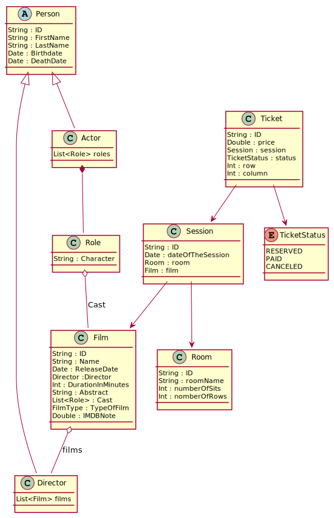

#Business object for the films :

## Film : 🎞️
 - ID
 - Name
 - Date
 - Director
 - Time (in second or minutes)
 - Abstract
 - Cast
 - type of film (Sci-fi ; romance ; adventure...)
 - IMDB note

## Person : 🙍
- ID
- First Name
- Last Name
- Birthdate
- Death date
- ### Director: 
  * List of films
- ### Actor:
  - List of roles
  
# Business object for the session :

## Session :
- ID
- Film
- Date (day + time (fo instance 15/10/2021-18:30:00))
- Room

## Room :
- ID
- Number/name of the room
- Number of sit
- Number of rows

(it means that for a room with 50 sits and 5 row, there are 10 sits per rows)

## Ticket
- ID
- Session
- Price
- Status (RESERVED/PAID/CANCELED)
- Sit (row/column)

